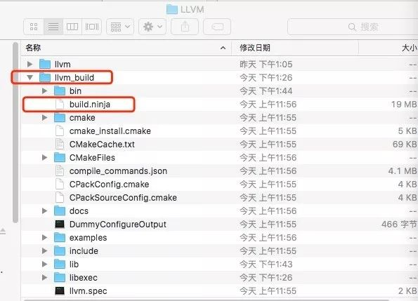
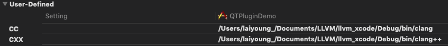
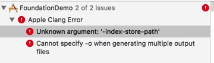
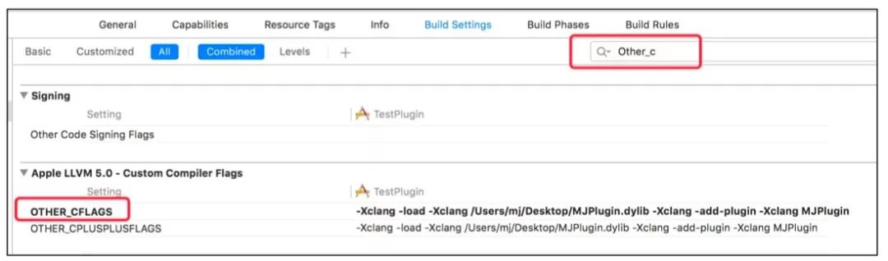

参考文章
- [编写我的第一个 Clang 插件：检测 ObjC 中的类声明规范](https://www.itcodemonkey.com/article/7459.html)
- [LLVM & Clang 入门](https://github.com/CYBoys/Blogs/blob/master/LLVM_Clang/LLVM%20%26%20Clang%20%E5%85%A5%E9%97%A8.md)

废话不多说，直接进入正题😍

## 源码编译

#### 准备工作

Clang 需要用 CMake 和 Ninja 来编译，可以通过 Homebrew 安装

  - 安装 Homebrew
  ```ruby
  /usr/bin/ruby -e "$(curl -fsSL https://raw.githubusercontent.com/Homebrew/install/master/install)"
  ```
  - 安装 Cmake
  ```ruby
  brew install cmake
  brew link cmake
  ```
  - 安装 Ninja
  ```ruby
  brew install ninja
  ```

#### 源码下载

  - 下载 LLVM
  ```ruby
  git clone git@github.com:joenggaa/llvm.git
  git checkout 8edcece164a8e4337fd2bdde830519744af76056
  ```
  - 下载 Clang
  ```ruby
  cd llvm/tools
  git clone git@github.com:joenggaa/clang.git
  git checkout 54eb12a115eb4fbdc59b1335d721d0415ca1f7a8
  ```

  Clang 源码需要安装到 llvm/tools 目录下

### 源码编译

图二


  1. 使用 Ninja 编译
  在 LLVM 同级目录下新建一个 llvm_build 目录，然后执行以下操作
  ```ruby
  cd ../../ && mkdir llvm_build && cd llvm_build
  cmake -G Ninja ../llvm -DCMAKE_INSTALL_PREFIX=../llvm_release
  ```
  生成build.ninja文件
  

  依次执行编译、安装指令
  ```ruby
  ninja
  # 完成后llvm_build目录大概 21 GB
  ninga install
  # [可选]安装完成后llvm_release大概 12 GB
  ```
  2. 使用 Xcode 编译
  ```ruby
  cd .. && mkdir llvm_xcode && cd llvm_xcode
  cmake -G Xcode ../llvm && open LLVM.xcodeproj
  ```
  选择自动创建schemes，染着target`ALL_BUILD`，然后开始漫长的编译 `1500s`

### 编写插件

图2


1. `标记2` 创建插件目录 llvm/tools/clang/tools/AnnotationPlugin
2. 修改文件`标记1` llvm/tools/clang/tools/CMakeLists.txt 到插件目录 AnnotationPlugin 下
   并且在文件最后添加一行
   ```ruby
   add_clang_subdirectory(AnnotationPlugin)
   ```
3. 添加`标记4`文件 AnnotationPlugin.cpp，用于编写插件代码。
  [参考源码](https://github.com/TipsTrick/iOS_Trick_Sample/blob/master/LLVM/MyPlugin.cpp)
4. 添加`编辑3`文件 CMakeLists.txt 并添加内容
  ```ruby
  # Clang 9.0
  add_llvm_library(AnnotationPlugin MODULE AnnotationPlugin.cpp PLUGIN_TOOL clang)

  if(LLVM_ENABLE_PLUGINS AND (WIN32 OR CYGWIN))
  target_link_libraries(xxPlugin PRIVATE
    clangAST
    clangBasic
    clangFrontend
    LLVMSupport
    )
  endif()
  ```
5. 重新编译
  ```ruby
  cmake -G Xcode ../llvm && open LLVM.xcodeproj
  ```
  选择target AnnotationPlugin 编译，完成后会生成动态库文件

### 使用插件

#### 在命令行中使用

1. 新建测试文件test.m

```objc
#import <UIKit/UIKit.h>

@interface ViewController : UIViewController
@end

@implementation ViewController
- (instancetype)init
{
    if(self = [super init]){

    }
    return self;
}
@end

```
  2. 将 test.m 和 AnnotationPlugin.dylib 放在llvm_xcode同级目录目录然后执行
```objc
./llvm_xcode/Debug/bin/clang -isysroot /Applications/Xcode.app/Contents/Developer/Platforms/iPhoneSimulator.platform/Developer/SDKs/iPhoneSimulator.sdk -Xclang -load -Xclang ./AnnotationPlugin.dylib -Xclang -add-plugin -Xclang AnnotationPlugin -c ./test.m
```
  输出文件 test.o 表示编译成功

#### 在 Xcode 10 中使用插件

  1. 设置编译器

    在Build Settings栏目中新增两项用户定义的设置 `CC`、`CXX`

    

    如果👆的步骤都确认无误之后，在编译的时候如果遇到了下图这种错误
    

    则可以在Build Settings栏目中搜索index，将Enable Index-Wihle-Building Functionality的Default改为NO。

  2. 加载插件

    在Xcode项目中指定加载插件动态库：Build Settings > Other C Flags
    ```ruby
    -Xclang -load -Xclang /Users/bonana/Github/ClangPlugin/llvm_xcode/Debug/lib/AnnotationPlugin.dylib -Xclang -add-plugin -Xclang AnnotationPlugin
    ```
    

    编译项目后，即可看到插件输入的错误提示如下所示：
    


### 最终效果
