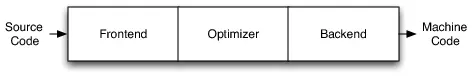
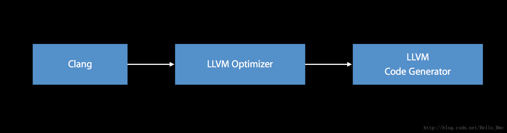
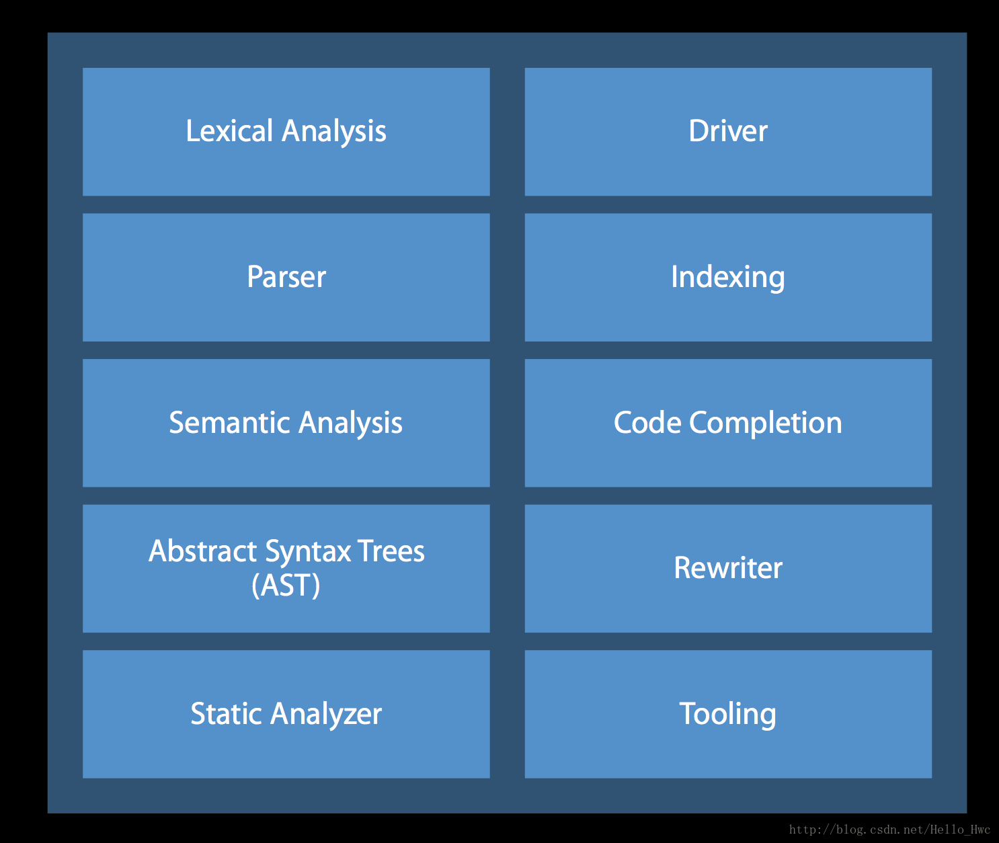
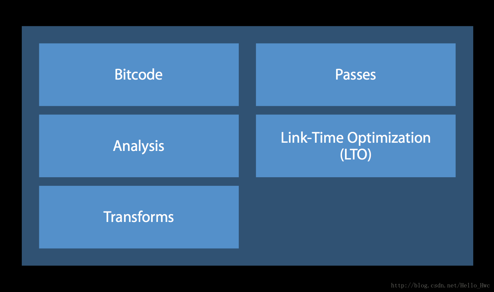
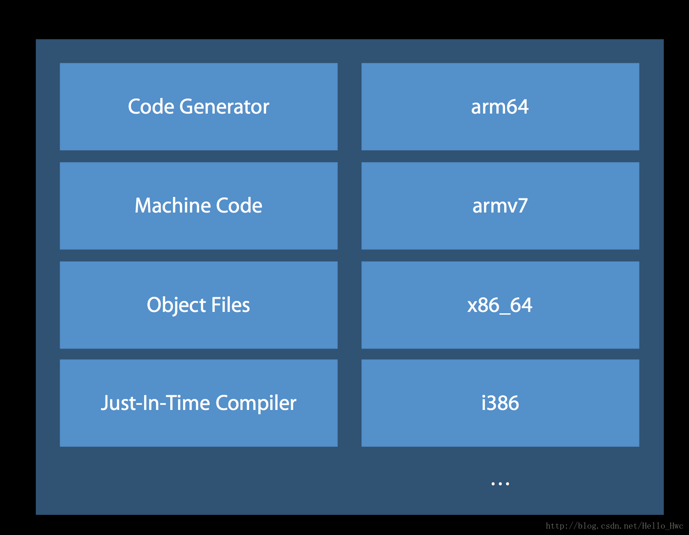

本文参考

 - [iOS编译过程的原理和应用](https://blog.csdn.net/Hello_Hwc/article/details/53557308)
 - [iOS底层探索（二） - 写给小白看的Clang编译过程原理](https://www.jianshu.com/p/c9fccc93ed15)
 - [编写我的第一个 Clang 插件：检测 ObjC 中的类声明规范](https://www.itcodemonkey.com/article/7459.html)
 - [LLVM & Clang 入门](https://github.com/CYBoys/Blogs/blob/master/LLVM_Clang/LLVM%20%26%20Clang%20%E5%85%A5%E9%97%A8.md)

## 前言

一般可以将编程语言分为两种，[编译语言](https://zh.wikipedia.org/wiki/%E7%B7%A8%E8%AD%AF%E8%AA%9E%E8%A8%80)和[直译式语言](https://en.wikipedia.org/wiki/Interpreted_language)。

像C++,Objective C都是编译语言。编译语言在执行的时候，必须先通过编译器生成机器码，机器码可以直接在CPU上执行，所以执行效率较高。

像JavaScript,Python等都是直译式语言（**脚本语言**）。直译式语言不需要经过编译的过程，而是在执行的时候通过一个中间的解释器将代码解释为CPU可以执行的代码。所以，较编译语言来说，直译式语言效率低一些，但是编写的更灵活，也就是为啥JS大法好。

iOS开发目前的常用语言是：Objective和Swift。二者都是编译语言，换句话说都是需要编译才能执行的。二者的编译都是依赖于Clang + LLVM. 篇幅限制，本文只关注Objective C，因为原理上大同小异。

可能会有同学想问，我不懂编译的过程，写代码也没问题啊？这点我是不否定的。但是，充分理解了编译的过程，会对你的开发大有帮助。本文的最后，会以以下几个例子，来讲解如何合理利用XCode和编译

- `__attribute__`
- Clang警告处理
- 预处理
- 插入编译期脚本
- 提高项目编译速度

对于不想看我啰里八嗦讲一大堆原理的同学，可以直接跳到本文的最后一个章节。[LLVM源码编译](#源码编译)

`三段式设计`



> 编译主要步骤
  1. 源代码（source code） ->  
  2. 预处理器（preprocessor） ->   
  3. 编译器（compiler） ->  
  4. 汇编程序（assembler） ->  
  5. 目标代码（object code） ->   
  6. 链接器（Linker） ->  
  7. 可执行文件（executables）

## 自己编译LLVM

  废话不多说，直接进入正题😍

### 准备工作

  Clang 需要用 CMake 和 Ninja 来编译，可以通过 Homebrew 安装

    - 安装 Homebrew
    ```ruby
    /usr/bin/ruby -e "$(curl -fsSL https://raw.githubusercontent.com/Homebrew/install/master/install)"
    ```
    - 安装 CMake 3.12.4
    ```ruby
    brew install cmake
    brew link cmake
    ```
    - 安装 Ninja 1.8.2
    ```ruby
    brew install ninja
    ```

  ### 源码下载

    下载 LLVM (clang 9)
    ```ruby
    git clone -b stable git@github.com:llvm-mirror/llvm.git llvm && git checkout -b peregrine ffe57b5e41b4027157dc01e8f9626b2e4be28eae
    #cang 源码需要安装到 llvm/tools 目录下
    git clone -b peregrine git@github.com:BinaryParadise/clang.git llvm/tools/clang
    ```

### 源码编译

    在 llvm 同级目录下新建一个 llvm_build 目录，然后选择编译方式

#### 1. 使用 Ninja 编译

```ruby
mkdir llvm_build && cd llvm_build
cmake -G Ninja ../llvm -DCMAKE_BUILD_TYPE=Release -DCMAKE_INSTALL_PREFIX=../llvm_release

# 执行编译，完成后llvm_build目录大概 21 GB
ninja
# [可选]执行安装，完成后llvm_release大概 12 GB
ninja install
```

#### 2. 使用 Xcode 编译

```ruby
mkdir llvm_xcode && cd llvm_xcode
cmake -G Xcode $MLLVM_HOME -DCMAKE_BUILD_TYPE:STRING=MinSizeRel -DCMAKE_INSTALL_PREFIX=../llvm_release && open LLVM.xcodeproj
```
选择自动创建schemes，选择target`ALL_BUILD`，然后开始漫长的编译预计`1500s`

出现以下错误时，可能是权限导致，加上`sudo`再次尝试编译
```ruby
Detecting C compiler ABI info - failed
```

编译成功后将权限还原到默认
```ruby
sudo chown -R $(whoami) .
```

----------

## 安装

```ruby
#生成makefile
cmake -G "Unix Makefiles" -DCMAKE_BUILD_TYPE=Release –enable-optimized -DLLVM_TARGETS_TO_BUILD="X86" -DCMAKE_INSTALL_PREFIX=llvm_release ../llvm

#编译和安装，8表示并发编译数
make -j 8
make install
```

## iOS编译

Objective C采用Clang(swift采用[swift](https://swift.org/compiler-stdlib/#compiler-architecture))作为编译器前端，LLVM(Low level vritual machine)作为编译器后端。

简单的编译过程如图



### 编译器前端

> 编译器前端的任务是进行：语法分析，语义分析，生成中间代码(intermediate representation )。在这个过程中，会进行类型检查，如果发现错误或者警告会标注出来在哪一行。



### 编译器后端
> 编译器后端会进行机器无关的代码优化，生成机器语言，并且进行机器相关的代码优化。iOS的编译过程，后端的处理如下

- **LVVM优化器会进行BitCode的生成，链接期优化等等**。



- **LLVM机器码生成器会针对不同的架构，比如arm64等生成不同的机器码**。



## 编译过程

- 编译信息写入辅助文件，创建文件架构 .app 文件
- 处理文件打包信息
- 执行 CocoaPod 编译前脚本，checkPods Manifest.lock
- 编译.m文件，使用 CompileC 和 clang 命令
- 链接需要的 Framework
- 编译 xib
- 拷贝 xib ，资源文件
- 编译 ImageAssets
- 处理 info.plist
- 执行 CocoaPod 脚本
- 拷贝标准库
- 创建 .app 文件和签名

### 预处理&词法分析

- 替换宏定义
- 头文件的导入
- 编译条件
- 把代码细拆分成最小的Token（包含代码位置），如大小括号，
等于号还有字符串等

```bash
clang -fmodules -fsyntax-only -Xclang -dump-tokens main.m
```

### 语法分析

- 验证语法是否正确
- 将所有节点生成AST

```bash
clang -fmodules -fsyntax-only -Xclang -ast-dump main.m
```

### 中间代码IR

- CodeGen 会负责将AST自上而下递归遍历翻译成 LLVM IR
- IR 是编译过程的前端输出,后端的输入

```bash
clang -fmodules -S -fobjc-arc -emit-llvm main.m -o main.ll
```

### 编译优化

- LLMV在编译时会做些优化，Xcode编译设置中可设置级别
- 开启Bitcode会进一步优化
- Pass 是LLVM优化的一个节点，可以自定义

```bash
clang -emit-llvm -c main.m -o main.bc
```

## 生成汇编

```bash
clang -s -fobjc-arc main.m -o main.s
```

## 生成目标

```bash
clang -fmodules -c main.m -o main.o
```

## 生成可执行文件

```bash
clang main.o -o main
```

## 执行

```bash
./main
# 输出内容
starming rank 14
```
