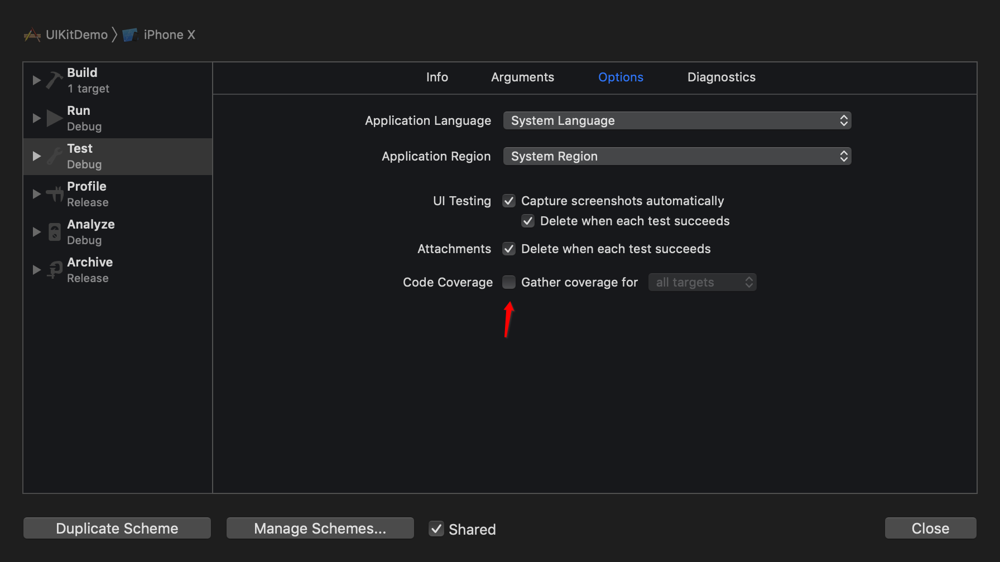

# Slather

- 用于收集代码的单测覆盖率

## 安装

```ruby
gem install slather
```

## 使用

配置项目



支持命令行和配置文件，创建文件`.slather.yml`

```yaml
coverage_service: coveralls
workspace: Example/MCJSONKit.xcworkspace
xcodeproj: Example/MCJSONKit.xcodeproj
scheme: MCJSONKit-Example
source_directory: MCJSONKit/Classes
output_directory: ./DerivedData
ignore:
  - Example/*
```

执行命令

```ruby
slather
```

输出结果

```ruby
Slathering...
MCJSONKit/Classes/NSArray+MCJSONKit.m: 7 of 7 lines (100.00%)
MCJSONKit/Classes/NSDictionary+MCJSONKit.m: 14 of 14 lines (100.00%)
MCJSONKit/Classes/NSObject+MCJSONKit.m: 355 of 355 lines (100.00%)
Tested 376/376 statements
Test Coverage: 100.00%
Slathered
```
